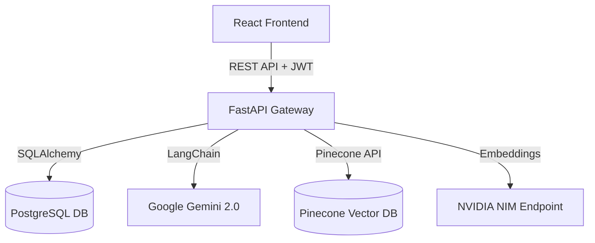
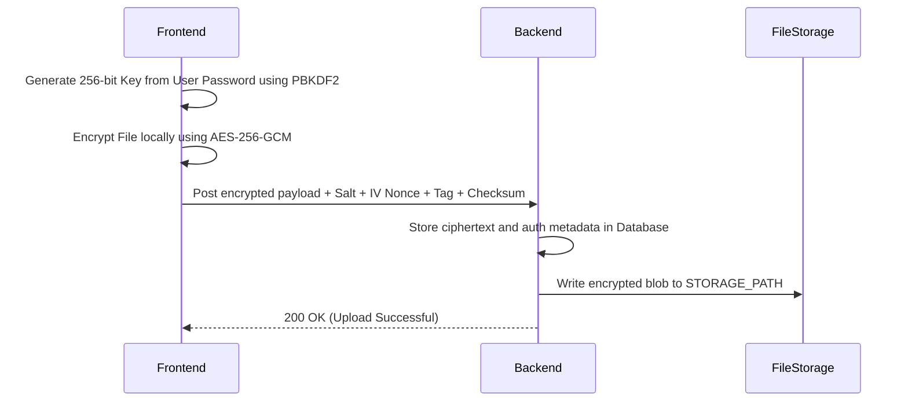

# STU-MINI Integration Guide

This guide details the integration parameters, handshake mechanisms, and design contracts between the React frontend and the FastAPI backend.

---

## 🏗 System Architecture Diagram



---

## 🔑 JWT Authentication Flow

The application secures endpoints using stateless JSON Web Tokens (JWT).

### Flow Sequence:
1. **Authentication request**: The user submits credentials via POST `/api/auth/login` or POST `/api/auth/register`.
2. **Access Token Generation**: Upon successful validation, the backend generates an access token signed with the HMAC-SHA256 (`HS256`) algorithm using `SECRET_KEY`.
3. **Token Cache (Frontend)**: The React app caches the JWT token in Redux state and local storage.
4. **Subsequent API Request**: The client inserts the token in the `Authorization` header on all subsequent requests:
   `Authorization: Bearer <TOKEN>`
5. **Decryption and Validation**: The backend parses the token, queries the user object from the DB, and validates its expiry.

---

## 🔄 DigiLocker Client-Side Encryption Flow

To guarantee file privacy, all documents are securely processed using cryptography.



- **Salt**: 16 bytes derivation salt.
- **Nonce (IV)**: 12 bytes initialization vector.
- **Tag**: 16 bytes GCM authentication tag.
- **Checksum**: SHA-256 hex checksum.

---

## 🌐 CORS (Cross-Origin Resource Sharing)

The API enforces strict origin validation to block unauthorized domain access.

### Backend Setup (`app/main.py`):
```python
from fastapi.middleware.cors import CORSMiddleware

app.add_middleware(
    CORSMiddleware,
    allow_origins=settings.CORS_ORIGINS,  # Default: ["http://localhost:5173", "http://localhost:3000"]
    allow_credentials=True,
    allow_methods=["*"],
    allow_headers=["*"],
)
```

### Frontend Configuration:
Ensure your Axios client is configured to send cookies and credentials:
```typescript
import axios from 'axios';

const api = axios.create({
  baseURL: import.meta.env.VITE_API_BASE_URL || 'http://localhost:8000',
  withCredentials: true
});
```

---

## 🤝 API Contract & Data Formats

### 1. Unified Success Payload Format
Standard JSON payloads returned from endpoints:
```json
{
  "status": "success",
  "data": { ... }
}
```

### 2. Standard Error Payload
All routes capture errors and format responses through `setup_exception_handlers`:
```json
{
  "error": "ValidationError",
  "message": "Detailed error context message...",
  "status_code": 400,
  "error_code": "VALIDATION_ERROR",
  "timestamp": "2026-06-25T16:59:00Z"
}
```

---

## 🚀 Live Event Stream: Mock Interview Session

During an active interview, state and progress are validated on every submit:
1. Client POSTs `/api/interview/start`. Gets first question.
2. User records/types answer and POSTs `/api/interview/answer`.
3. Backend processes the response using Gemini + LangChain to return:
   - Technical Accuracy score
   - Communication Clarity score
   - Relevance to Job score
   - Detailed strengths and improvement points
   - Next Question
4. Once question count exceeds `MAX_INTERVIEW_QUESTIONS` (7), backend flags `interview_complete: true`.
5. Frontend routes the user to the feedback dashboard fetching details from `/api/interview/feedback?sessionId=<ID>`.
